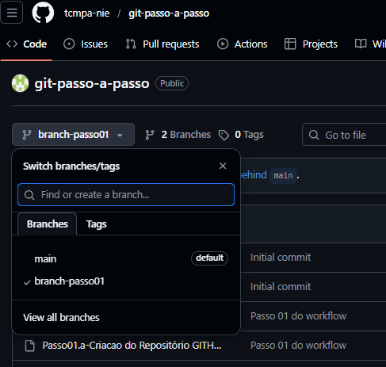

# Passo 02 : Modificação no código

Tendo _clonado_ o repositório para o seu computador, você deve habilitar esta cópia para receber as modificações necessárias ( adicionar, remover ou alterar arquivos e diretórios). Isto é feito criando-se um **_branch_** (ou ramificação) baseada na versão corrente do código do repositório ( geralmente denominada **_main_**). O git cria o registro de como estavam os arquivos (nomes, diretórios e seus conteúdos), permitindo assim identificar _**TODAS**_ as alterações feitas a partir deste momento.

Você não deve realizar nenhuma alteração sem antes criar um _**branch**_.

## Criando um novo _branch_


Sua próxima tarefa será criar um novo _**branch**_, então acesse agora o terminal de comandos e digite:
```bash

$ git checkout -b [nome-do-branch] 

```

O _**[nome-do-branch]**_ deve ser ÚNICO, portanto é uma boa idéia adicionar nele seu nome, data ou código de O.S. e/ou tarefa.

A partir deste momento você pode iniciar as alterações que julgar necessárias na cópia do repositório.


Vale lembrar que as alteraçoes se aplicarão **SOMENTE** à sua cópia local do repositório, e desta forma não interferirão no trabalho dos outros membros da equipe, nem serão vistas (por enquanto) no GITHUB.


## Área de Staging do _**git**_

O _git_ é um sistema de controle de versão de arquivos _distribuído_, o que significa que após realizar o _clone_ do repositório o usuário trabalha totalmente _offline_, dependendo exclusivamente dos recursos de seu computador para realizar as alterações.

Para gerenciar as alterações nos arquivos, o _git_ se utiliza de uma estratégia simples e poderosa: ele mantém os arquivos em áreas distintas durante seu ciclo de alterações, que são:
 - Área de Trabalho (Working Tree): Onde você edita seus arquivos. Os arquivos recém adicionados ao projetos ficam registrados nesta área, sem que o _git_ guarde cada alterações sofridas por eles.
 - Staging Area (Índice): O _git_ passa a gerenciar os arquivos registrados nesta área (staging). É necessário que você indique o momento mais adequado para que os arquivos passem ao controle de alterações do _git_. Para isso, deve-se usar o seguinte comando.
 ```bash
   $ git add .
 ```
 - Git Repository (Commit): Após realizar uma ou mais alterações nos arquivos da _staging area_, você aplica o comando _commit_ de forma a estabelecer uma espécie de marca d'agua nos arquivos do repositório, indicando uma posição no histórico do repositório que poderá ser replicada para os outros membros da equipe. Para isso, deve-se usar o seguinte comando.
 ```bash
   $ git commit -m "Mensagem que será associada a este commit"
 ```


Vale lembrar que este ciclo ocorre somente no seu computador, com o git registrando todos os marcos de alteração (commits) em seu _**repositório local**_.


## Enviando minhas alterações para o repositório remoto

Após ter realizado uma ou mais vezes o ciclo de alterações descrito anteriormente e estar satisfeito com o resultado de suas alterações, você pode enviar suas alterações para o repositório remoto de origem no GITHUB, de forma a permitir que suas modificações sejam aplicadas à versão corrente do código fonte. Lembre-se que você deve estar trabalhando em um _branch_ no seu computador e caso não lembre o nome, use :

```bash
$ git status
```

Tudo pronto, então basta só executar o comando :

```bash

$ git push -u origin [nome-do-branch-em-uso] 

```

A partir deste momento o git envia seus arquivos alterados para o repositório remoto no GITHUB, organizados sob a identificação de seu _branch_, como ilustrado abaixo.




O próximo passo é 
