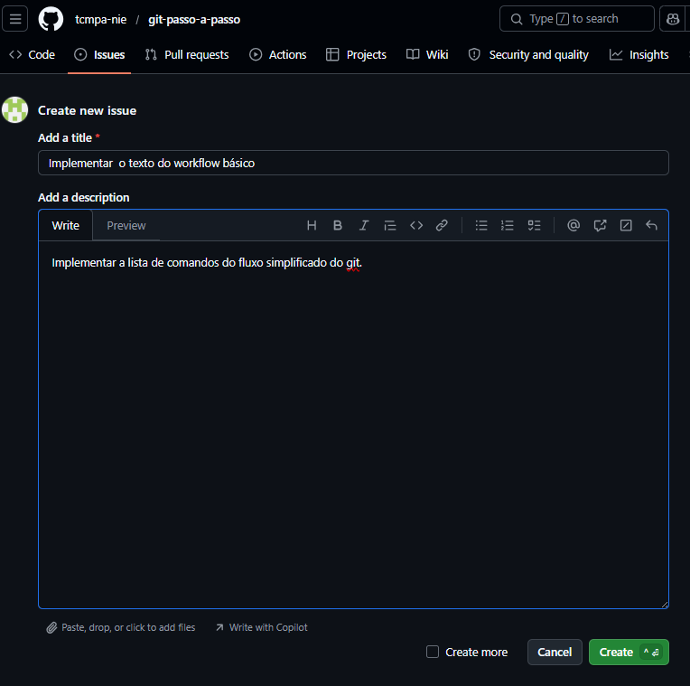
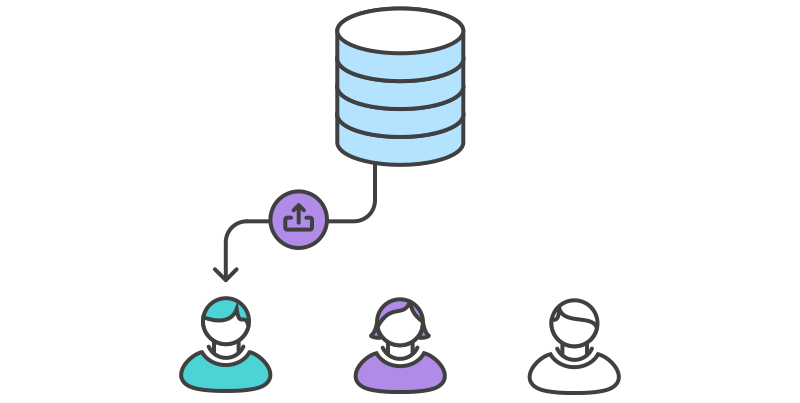
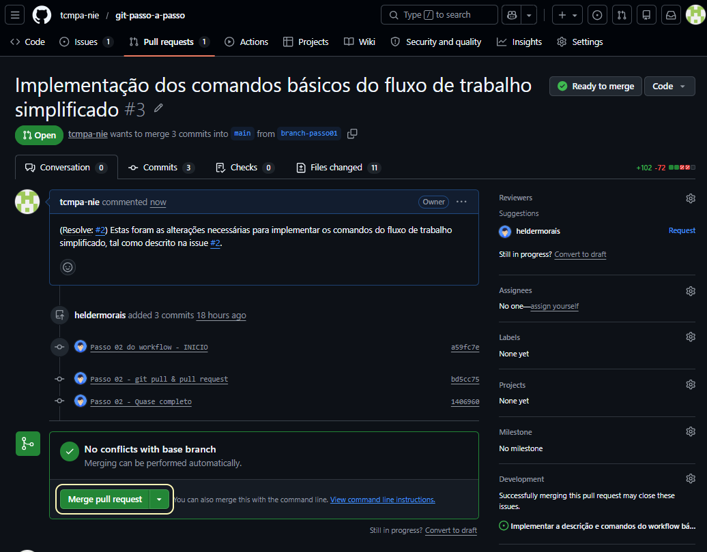
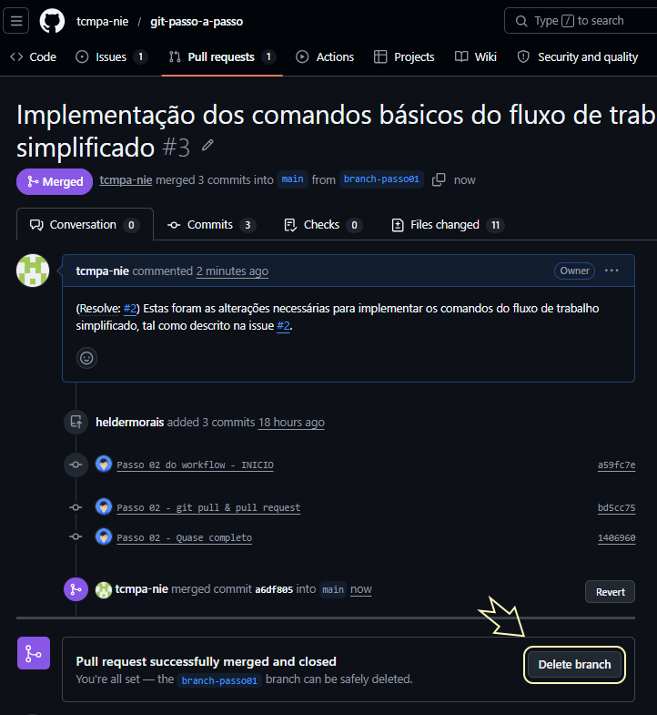

# Passo 03 : Pull Request & Merge de alterações


Neste passo, considere que você tenha completado todo o ciclo de _clonagem_ do repositório remoto, implementação de modificações com _commit & push_ para o repositório _origin_, porém tudo contido em sua _branch_.

O passo seguinte será de aplicar as suas alterações à _branch **main**_ do repositório remoto e dessa forma permitir que os outros membros da equipe passem a visualizá-las e sincronizá-las aos seus _branches_, se for conveniente ou necessário.


## O que está sendo feito ? Um pequeno ajuste de curso

É possível imaginar que quanto maior a equipe e mais distantes estiverem seus membros maior a necessidade de saber e monitorar quais alterações estão sendo implementadas e com que propósito (correção de erro, nova funcionalidade, documentação, etc ...). O GITHUB gerencia isso através de _Issues_ ("problemas"), onde a equipe registra as tarefas a ser implementadas (podendo definir outros metadados, como:  prioridade, tipo). 

Seguindo este objetivo, utilizamos os formulários do próprio GITHUB para fazer a criação da tarefa que deverá ser implementada, como ilustrado a seguir.





Cada uma destas tarefas criadas podem ser alvo de uma _branch_, vinculando a _issue_ a ela e permitindo rastrear quando uma determinada funcionalidade foi implementada, o autor da implementação e em que versão ela foi resolvida/fechada.

Podemos concluir então que a criação prévia de todas as tarefas a ser executadas é uma boa prática que **vale a pena** ser adotada pela equipe de desenvolvimento para todos os seus projetos.


## ... voltando ao fluxo ... criando o seu _pull request_



Para garantir a integridade dos arquivos do _branch_ principal do repositório remoto (_main_), cada um dos membros estão **impedidos** de realizar alterações diretamente nela. Após terem finalizado suas alterações em seu _branch_, cada desenvolvedor deve criar um _pull request_ (solicitação de _pull_) vinculado a este _branch_ e submete-o à consideração do gerente do projeto.


Note que, na descrição do _pull request_, o desenvolvedor faz a indicação da tarefa (_issue_) que foi implementada naquele _branch_ , seguindo a forma padronizada:

```
([prefixo]: [numero da _issue_])

exemplo -> (Resolve: #2) 
```

No momento em que este _pull request_ for **aprovado**, a situação da  _issue_ associada também é atualizada no histórico do repositório.

Após a criação do _pull request_, é tarefa do gerente do projeto a validação das alterações e, se estiver satisfeito, realizar a integração (_merge_) das alterações ali contidas no _branch **main**_.




Após realizado o _merge_, as alterações podem ser visualizadas junto dos arquivos da _branch **main**_, podendo o gerente optar por remover o branch associado, como ilustrado a seguir.




## Parabéns, sua equipe completou o workflow com sucesso !

Se você e sua equipe chegaram a este ponto, pode comemorar, pois já conseguem trabalhar de forma organizada, transparente e segura.

A seguir, vamos tratar alguns casos especiais e situações diferentes que podem ocorrer e indicar estratégias de abordagem e resolução.